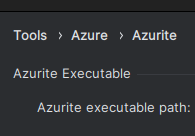

# Azure Function - Integração SQL Server ↔ PostgreSQL

Este projeto é uma **Azure Function em .NET 9**, responsável por realizar integração de dados entre um banco **SQL Server** (fonte) e um banco **PostgreSQL** (destino), utilizando lógica customizada e executando de forma **agendada** via `TimerTrigger`.

## 🛠️ Tecnologias e Ferramentas

- [.NET 9](https://dotnet.microsoft.com)
- [Azure Functions](https://learn.microsoft.com/azure/azure-functions/)
- [SQL Server (origem)](https://www.microsoft.com/sql-server/)
- [PostgreSQL (destino)](https://www.postgresql.org/)
- [JetBrains Rider](https://www.jetbrains.com/rider/) (com suporte para Azure Functions)
- [Azurite](https://learn.microsoft.com/en-us/azure/storage/common/storage-use-azurite) para simular serviços Azure localmente
- Docker (para bancos locais, opcional)

## 🛠️ JetBrains Rider

Install:
- https://learn.microsoft.com/en-us/azure/azure-functions/functions-run-local?tabs=linux%2Cisolated-process%2Cnode-v4%2Cpython-v2%2Chttp-trigger%2Ccontainer-apps&pivots=programming-language-csharp#install-the-azure-functions-core-tools

- https://learn.microsoft.com/en-us/azure/storage/common/storage-use-azurite?tabs=npm%2Cblob-storage#install-azurite

Run:
- `which azurite`

and configure it here

